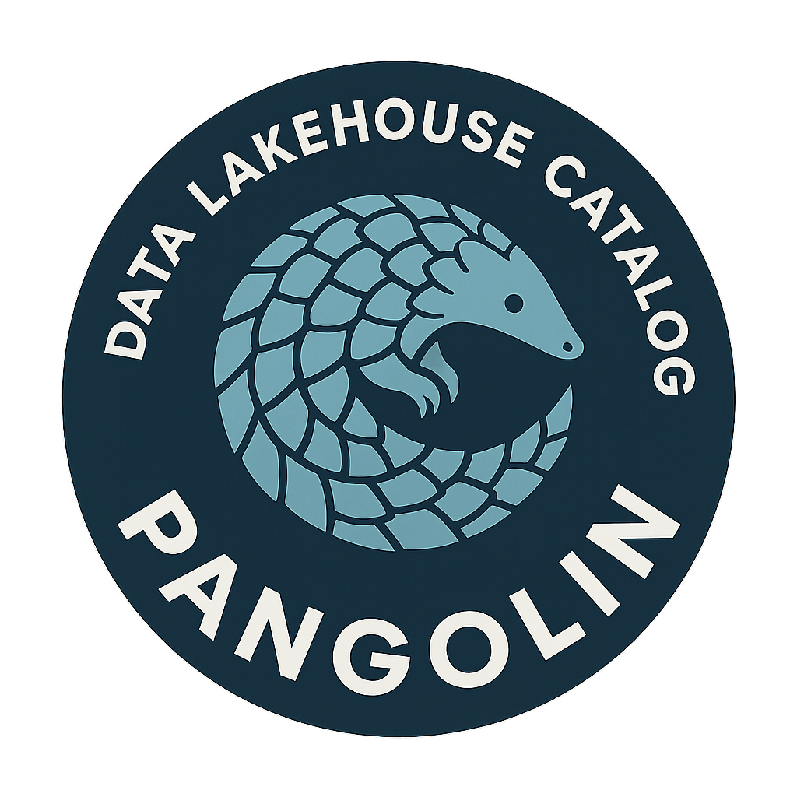

# Pangolin (Status: Alpha)

**A Rust-Based, Multi-Tenant, Iceberg-Compatible Lakehouse Catalog**

Pangolin is a high-performance catalog designed for modern lakehouse architectures. It supports Git-style branching, multi-tenancy, federated catalogs, and tracks any lakehouse asset type.

## Why Pangolin?

A pangolin is a strong metaphor for a data lakehouse catalog because its defining traits align closely with the core responsibilities of a catalog.

First, a pangolin is covered in layered scales. Each scale is distinct but part of a coherent whole. A lakehouse catalog works the same way. It organizes many independent assets—tables, views, files, models, and metadata—into a single, structured system. Each asset has its own schema, properties, and lineage, yet all are discoverable through one catalog.

Second, pangolins are defensive by design. They protect what matters by curling into a secure form. A catalog plays a similar role in governance. It enforces access controls, tracks ownership, and provides guardrails around sensitive data. Rather than blocking access outright, it enables safe and intentional use.

Third, pangolins are precise and deliberate. They move carefully and use strong claws to uncover food hidden beneath the surface. A lakehouse catalog does the same for data. It helps users uncover datasets buried across object storage, warehouses, and streams, exposing meaning through metadata, classification, and search.

Finally, pangolins are rare and specialized. They exist for a specific purpose and excel at it. A data lakehouse catalog is not a generic system. It is a purpose-built layer focused on clarity, trust, and navigation across complex data environments.

---

## 🚀 Quick Start

### Prerequisites
- Rust 1.92+
- Docker (optional, for MinIO)

### Running Locally
```bash
cd pangolin
cargo run --bin pangolin_api
```

### API Usage
See [Quick Start Guide](docs/getting-started/getting_started.md) for detailed setup and example `curl` commands.

---

## ✨ Key Features

- **Multi-Tenancy**: Full tenant isolation with dedicated namespaces and warehouses.
- **Iceberg REST Catalog**: 100% compliant with Apache Iceberg REST spec.
- **Git-like Branching**: Branch, tag, and merge catalogs for safe experimentation.
- **3-Way Merging**: Intelligent conflict detection with manual and automatic resolution strategies.
- **Federated Catalogs**: Connect to external Iceberg catalogs as a transparent proxy.
- **Service Users**: API key authentication for CI/CD, ETL, and automated pipelines.
- **Advanced Audit Logging**: Comprehensive tracking of 40+ actions across 19 resource types.
- **Multi-Cloud Storage**: Native support for AWS S3, Azure Blob, and Google Cloud Storage.
- **Credential Vending**: Securely vends AWS STS, Azure SAS, and GCP downscoped credentials.
- **Multiple Backends**: Metadata persistence via PostgreSQL, MongoDB, SQLite, or In-Memory.
- **Management UI**: Modern SvelteKit-based interface for Admins and Data Explorers.

---

## 📚 Documentation Index

### 🏁 1. Getting Started
*Quickest path from zero to a running lakehouse.*
- **[Onboarding Index](docs/getting-started/README.md)** - **Start Here!**
- **[Installation Guide](docs/getting-started/getting_started.md)** - Run Pangolin in 5 minutes.
- **[Auth Modes](docs/getting-started/auth-mode.md)** - Understanding Auth vs No-Auth.
- **[Deployment Guide](docs/getting-started/deployment.md)** - Local, Docker, and Production setup.
- **[Environment Variables](docs/getting-started/env_vars.md)** - Complete system configuration reference.

### 🏗️ 2. Core Infrastructure
*Managing the foundations: storage and metadata.*
- **[Infrastructure Features](docs/features/README.md)** - Index of all platform capabilities.
- **[Warehouse Management](docs/warehouse/README.md)** - Configuring S3, Azure, and GCS storage.
- **[Metadata Backends](docs/backend_storage/README.md)** - Memory, Postgres, MongoDB, and SQLite.
- **[Asset Management](docs/features/asset_management.md)** - Tables, Views, and CRUD operations.
- **[Federated Catalogs](docs/features/federated_catalogs.md)** - Proxying external REST catalogs.

### ⚖️ 3. Governance & Security
*Multi-tenancy, RBAC, and auditing.*
- **[Security Concepts](docs/features/security_vending.md)** - Identity and Credential Vending principles.
- **[Credential Vending (IAM Roles)](docs/features/iam_roles.md)** - Scoped cloud access (STS, SAS, Downscoped).
- **[Permission System](docs/permissions.md)** - Understanding RBAC and granular grants.
- **[Service Users](docs/features/service_users.md)** - Programmatic access and API key management.
- **[Audit Logging](docs/features/audit_logs.md)** - Global action tracking and compliance.

### 🧪 4. Data Life Cycle
*Git-for-Data and maintenance workflows.*
- **[Branch Management](docs/features/branch_management.md)** - Working with isolated data environments.
- **[Merge Operations](docs/features/merge_operations.md)** - The 3-way merge workflow.
- **[Business Metadata & Discovery](docs/features/business_catalog.md)** - Search, tags, and access requests.
- **[Maintenance Utilities](docs/features/maintenance.md)** - Snapshot expiration and compaction.

### 🛠️ 5. Interfaces & Integration
*Connecting tools and using our management layers.*
- **[Management UI](docs/ui/README.md)** - Visual guide to the administration portal.
- **[PyPangolin SDK (Official)](pypangolin/README.md)** - Rich Python client with Git-like operations and types.
- **[PyIceberg Integration](docs/pyiceberg/README.md)** - Native Python client configuration.
- **[CLI Reference](docs/cli/README.md)** - Documentation for `pangolin-admin` and `pangolin-user`.
- **[API Reference](docs/api/README.md)** - Iceberg REST and Management API specs.

### 🏗️ 6. Architecture & Internals
*Deep-dives for developers and contributors.*
- **[Architecture Overview](docs/architecture/README.md)** - System design and component interaction.
- **[Data Models](docs/architecture/models.md)** - Understanding the internal schema.
- **[CatalogStore Trait](docs/architecture/catalog-store-trait.md)** - Extending Pangolin storage.
- **[Developer Utilities](docs/utilities/README.md)** - Tools for contributors (e.g. OpenAPI generation).

### 🎓 7. Best Practices
*Production guides and operational wisdom.*
- **[Best Practices Index](docs/best-practices/README.md)** - Complete guide to operating Pangolin.
- **[Deployment & Security](docs/best-practices/deployment.md)** - Production checklists.
- **[Scalability](docs/best-practices/scalability.md)** - Tuning for high performance.
- **[Iceberg Tuning](docs/best-practices/iceberg.md)** - Optimizing table layout and compaction.

---

## 🚦 Project Status

**Current Version**: Alpha

**Production-Ready Features**:
- ✅ Iceberg REST Catalog API (100% Compliant)
- ✅ Multi-Tenancy & Tenant Isolation
- ✅ Git-like Branching & Tagging
- ✅ Advanced Audit Logging (UI/CLI/API)
- ✅ Service Users & API Keys
- ✅ PostgreSQL, MongoDB, and SQLite Backends
- ✅ Multi-Cloud Storage (S3, Azure, GCS)
- ✅ Management UI for Admins & Explorers

---

## 📖 Quick Examples

### Create a Catalog (API)
```bash
curl -X POST http://localhost:8080/api/v1/catalogs \
  -H "Authorization: Bearer $TOKEN" \
  -d '{
  "name": "production",
  "warehouse_name": "main_s3",
  "storage_location": "s3://my-bucket/warehouse"
}'
```

### Create a Branch (CLI)
```bash
pangolin-user create-branch dev --from main --catalog production
```

### Use with PyIceberg
```python
from pyiceberg.catalog import load_catalog

catalog = load_catalog(
    "pangolin",
    **{
        "uri": "http://localhost:8080",
        "warehouse": "production",
        "token": "your-jwt-token",
        "header.X-Iceberg-Access-Delegation": "vended-credentials",
    }
)

# Load a table on the 'dev' branch
table = catalog.load_table("analytics.sales@dev")
df = table.scan().to_pandas()
```

---

## 📄 License

MIT License - see [LICENSE](LICENSE) file for details.

---

## 📞 Support

- **Documentation**: See [docs/](docs/) directory.
- **Issues**: [GitHub Issues](https://github.com/AlexMercedCoder/Pangolin/issues).
- **Discussions**: [GitHub Discussions](https://github.com/AlexMercedCoder/Pangolin/discussions).
