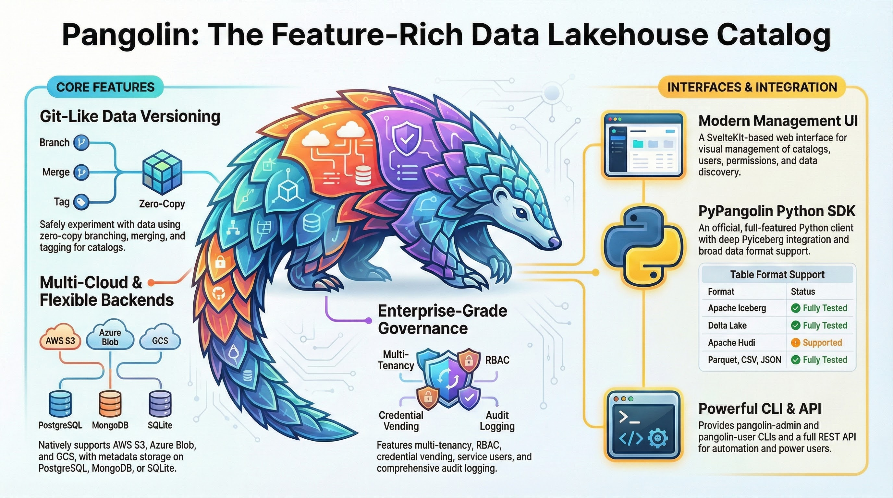

# Pangolin (Status: Alpha)

**A Rust-Based, Multi-Tenant, Iceberg-Compatible Lakehouse Catalog**

Pangolin is a high-performance catalog designed for modern lakehouse architectures. It supports Git-style branching, multi-tenancy, federated catalogs, and tracks any lakehouse asset type.



## Why Pangolin?

A pangolin is a strong metaphor for a data lakehouse catalog because its defining traits align closely with the core responsibilities of a catalog.

First, a pangolin is covered in layered scales. Each scale is distinct but part of a coherent whole. A lakehouse catalog works the same way. It organizes many independent assets—tables, views, files, models, and metadata—into a single, structured system. Each asset has its own schema, properties, and lineage, yet all are discoverable through one catalog.

Second, pangolins are defensive by design. They protect what matters by curling into a secure form. A catalog plays a similar role in governance. It enforces access controls, tracks ownership, and provides guardrails around sensitive data. Rather than blocking access outright, it enables safe and intentional use.

Third, pangolins are precise and deliberate. They move carefully and use strong claws to uncover food hidden beneath the surface. A lakehouse catalog does the same for data. It helps users uncover datasets buried across object storage, warehouses, and streams, exposing meaning through metadata, classification, and search.

Finally, pangolins are rare and specialized. They exist for a specific purpose and excel at it. A data lakehouse catalog is not a generic system. It is a purpose-built layer focused on clarity, trust, and navigation across complex data environments.

---

## 🚀 Quick Start

### Prerequisites
- Rust 1.94+
- Docker (optional, for MinIO)

### Running Locally
```bash
cd pangolin
cargo run --bin pangolin_api
```

### API Usage
See [Quick Start Guide](docs/getting-started/getting_started.md) for detailed setup and example `curl` commands.

---

## ✨ Key Features

- **Multi-Tenancy**: Tenant isolation with dedicated namespaces and warehouses, verified by tests against the production auth middleware.
- **Iceberg REST Catalog**: Implements the core of the Apache Iceberg REST spec — namespace and table CRUD, commits with full requirement enforcement, and credential vending. Not yet complete: see [Iceberg REST coverage](#iceberg-rest-coverage).
- **Git-like Branching**: Branch, tag, and merge catalogs for safe experimentation.
- **3-Way Merging**: Intelligent conflict detection with manual and automatic resolution strategies.
- **Federated Catalogs**: Connect to external Iceberg catalogs as a transparent proxy.
- **Service Users**: API key authentication for CI/CD, ETL, and automated pipelines.
- **Advanced Audit Logging**: Comprehensive tracking of 40+ actions across 19 resource types.
- **Multi-Cloud Storage**: Native support for AWS S3, Azure Blob, and Google Cloud Storage.
- **Credential Vending**: Securely vends AWS STS, Azure SAS, and GCP downscoped credentials.
- **Multiple Backends**: Metadata persistence via PostgreSQL, MongoDB, SQLite, or In-Memory.
- **Management UI**: Modern SvelteKit-based interface for Admins and Data Explorers.

---

## 📚 Documentation Index

### 🏁 1. Getting Started
*Quickest path from zero to a running lakehouse.*
- **[Onboarding Index](docs/getting-started/README.md)** - **Start Here!**
- **[Installation Guide](docs/getting-started/getting_started.md)** - Run Pangolin in 5 minutes.
- **[Auth Modes](docs/getting-started/auth-mode.md)** - Understanding Auth vs No-Auth.
- [Deployment Guide](docs/getting-started/deployment.md) - Local, Docker, and Production setup.
- [Environment Variables](docs/getting-started/env_vars.md) - Complete system configuration reference.

### 📖 2. How-To Reference Guides
*Comprehensive operations manual for API, CLI, SDK, and UI.*
- **[Reference Index](docs/reference/README.md)** - **Everything in one place.**
- [Tenants & Users](docs/reference/tenants.md)
- [Access Control (RBAC/TBAC)](docs/reference/access_control.md)
- [Warehouses & Catalogs](docs/reference/warehouses.md)
- [Assets & Metadata](docs/reference/assets.md)

### 🏗️ 3. Core Infrastructure
*Managing the foundations: storage and metadata.*
- **[Infrastructure Features](docs/features/README.md)** - Index of all platform capabilities.
- **[Warehouse Management](docs/warehouse/README.md)** - Configuring S3, Azure, and GCS storage.
- **[Metadata Backends](docs/backend_storage/README.md)** - Memory, Postgres, MongoDB, and SQLite.
- **[Asset Management](docs/features/asset_management.md)** - Tables, Views, and CRUD operations.
- **[Federated Catalogs](docs/features/federated_catalogs.md)** - Proxying external REST catalogs.
- **[Known Issues](docs/known-issues/README.md)** - Documented limitations and active bugs (e.g., SQL backend quirks).

### ⚖️ 4. Governance & Security
*Multi-tenancy, RBAC, and auditing.*
- **[Security Concepts](docs/features/security_vending.md)** - Identity and Credential Vending principles.
- **[Credential Vending (IAM Roles)](docs/features/iam_roles.md)** - Scoped cloud access (STS, SAS, Downscoped).
- **[Permission System](docs/permissions.md)** - Understanding RBAC and granular grants.
- **[Service Users](docs/features/service_users.md)** - Programmatic access and API key management.
- **[Audit Logging](docs/features/audit_logs.md)** - Global action tracking and compliance.

### 🧪 5. Data Life Cycle
*Git-for-Data and maintenance workflows.*
- **[Branch Management](docs/features/branch_management.md)** - Working with isolated data environments.
- **[Merge Operations](docs/features/merge_operations.md)** - The 3-way merge workflow.
- **[Business Metadata & Discovery](docs/features/business_catalog.md)** - Search, tags, and access requests.
- **[Maintenance Utilities](docs/features/maintenance.md)** - Snapshot expiration and compaction.

### 🛠️ 6. Interfaces & Integration
*Connecting tools and using our management layers.*
- **[Management UI](docs/ui/README.md)** - Visual guide to the administration portal.
- **[PyPangolin SDK (Official)](pypangolin/README.md)** - Rich Python client with Git-like operations and types.
- **[PyIceberg Integration](docs/pyiceberg/README.md)** - Native Python client configuration.
- **[CLI Reference](docs/cli/README.md)** - Documentation for `pangolin-admin` and `pangolin-user`.
- **[API Reference](docs/api/README.md)** - Iceberg REST and Management API specs.

### 🏗️ 7. Architecture & Internals
*Deep-dives for developers and contributors.*
- **[Architecture Overview](docs/architecture/README.md)** - System design and component interaction.
- **[Data Models](docs/architecture/models.md)** - Understanding the internal schema.
- **[CatalogStore Trait](docs/architecture/catalog-store-trait.md)** - Extending Pangolin storage.
- **[Developer Utilities](docs/utilities/README.md)** - Tools for contributors (e.g. OpenAPI generation).

### 🎓 8. Best Practices
*Production guides and operational wisdom.*
- **[Production Runbook](docs/operations/runbook.md)** - Health, metrics, incidents, upgrades, backup.
- **[Backend Feature Parity](docs/operations/backend-parity.md)** - Which features work on which backend.
- **[OAuth / SSO](docs/operations/oidc.md)** - Configuration, the 0.6.0 client change, and OIDC limitations.
- **[Best Practices Index](docs/best-practices/README.md)** - Complete guide to operating Pangolin.
- **[Deployment & Security](docs/best-practices/deployment.md)** - Production checklists.
- **[Scalability](docs/best-practices/scalability.md)** - Tuning for high performance.
- **[Iceberg Tuning](docs/best-practices/iceberg.md)** - Optimizing table layout and compaction.

---

## 🚦 Project Status

**Current version: 0.6.0. Status: Alpha.**

Pangolin is pre-1.0 software under active hardening. It is a capable catalog
with a broad feature set, and it is not yet something we would tell you to put
in front of a production data lake without reading the rest of this section.

0.6.0 is a **security release**. If you run anything earlier, upgrade: it fixes
a remotely exploitable OAuth account-takeover path, a working default JWT
signing secret published in this repository, an authentication bypass, an
unauthenticated denial-of-service primitive, and an Iceberg commit path that
could silently fork snapshot lineage under concurrent writers. See
[SECURITY.md](SECURITY.md) for the full list and the upgrade steps.

### Maturity by area

| Area | Maturity | Notes |
|---|---|---|
| Iceberg REST — namespaces, tables, commits | **Solid** | Commit requirements including `assert-ref-snapshot-id` are enforced; unsupported operations return an error rather than a false `200 OK` |
| Iceberg REST — full spec coverage | **Partial** | Several endpoints are missing; see below |
| Multi-tenancy and isolation | **Solid** | Tenant scope is a required parameter throughout; isolation tests pass against the production middleware |
| Git-style branching, tags, merge | **Good** | Merge direction and branch-asset tracking were fixed in 0.6.0 |
| RBAC, service users, API keys | **Good** | API keys carry a key ID, so authentication is one bcrypt verification rather than a scan |
| Audit logging | **Good** | 40+ actions, 19 resource types, plus authentication events from 0.6.0. Writes are best-effort and are not tamper-evident |
| Observability | **New in 0.6.0** | Prometheus metrics, request IDs, working `RUST_LOG`, real health endpoints |
| PostgreSQL backend | **Good** | The recommended backend. Provisioning from a fresh database was broken before 0.6.0 |
| SQLite backend | **Good** | Single-writer; suitable for one node |
| MongoDB backend | **Beta** | No index management, no transactions, four known-failing tests |
| Kubernetes deployment | **Good** | The chart shipped referencing three templates that did not exist; all present and CI-linted from 0.6.0 |
| Transactions for admin operations | **Partial** | PostgreSQL wraps `delete_catalog`, `delete_branch` and `merge_branch`; MongoDB wraps `delete_catalog` where the deployment supports sessions. Branch creation by copy is still not atomic |
| HA at N > 1 replicas | **Partial** | See below |
| Backup / restore / DR | **Undocumented and untested** | |

### Known limitations

> For the reconciled view of what is done and what is not — across both audit
> documents and every release — see **[STATUS.md](STATUS.md)**.


Stated plainly rather than buried:

- **Administrative multi-statement operations are only partly transactional.**
  PostgreSQL wraps a cascading catalog delete, a branch delete, a branch merge
  and — from 0.8.0 — creating a branch by copying assets. SQLite wraps the same
  branch-by-copy path. MongoDB wraps a cascading catalog delete where the
  deployment supports a session; a standalone `mongod` cannot, and MongoDB has
  no atomic branch-by-copy, so the API falls back to sequential statements and
  says so in the logs. On that path a failure partway through leaves the branch
  incomplete — but the caller now gets a `500` naming the branch, rather than
  the `200` it used to get. Take a backup before large administrative
  operations.
  (The Iceberg table-commit path *is* safe — it uses compare-and-swap with
  requirement enforcement.)
- **Rate limiting is per replica.** The authentication endpoints are throttled
  per source address *and* per account (`PANGOLIN_AUTH_RATE_LIMIT`, default 10
  per `PANGOLIN_AUTH_RATE_WINDOW_SECS`, default 60). The counters are
  in-process, so with N replicas the effective limit is N times the configured
  one. Set `PANGOLIN_TRUST_FORWARDED_FOR=true` **only** behind a proxy that
  overwrites `X-Forwarded-For`; trusting it otherwise lets a caller set the
  header per request and bypass the per-address half entirely.
- **OIDC is implemented for providers that support it** (Google, Microsoft,
  Okta, and any IdP via `PANGOLIN_<PROVIDER>_ISSUER`): PKCE, `id_token`
  signature validation against the provider's JWKS, and `iss`/`aud`/`exp`/
  `nonce` checks. **GitHub is not an OIDC provider** — it issues no `id_token`
  — so a GitHub login still relies on the userinfo endpoint;
  `PANGOLIN_OIDC_REQUIRE=true` refuses it. The PKCE verifier is held in process,
  so OAuth needs session affinity across replicas. See
  [docs/operations/oidc.md](docs/operations/oidc.md).
- **Warehouse cloud credentials are encrypted at rest only if you configure a
  key.** Set `PANGOLIN_ENCRYPTION_KEY` (`openssl rand -base64 32`); without it
  they are stored in plaintext and the server says so at startup. See
  [docs/operations/encryption.md](docs/operations/encryption.md), which is also
  honest about what envelope encryption does not protect against. The
  in-process warehouse cache is still node-local, so a rotated credential can be
  served by a peer for up to the cache TTL (5s by default).
- **Running more than one replica works but is unproven.** The background token
  cleanup job runs in every replica with no coordination, and the OAuth nonce
  store is in-process, so OAuth needs session affinity.
- **No backup, restore or DR procedure has been tested**, and there is no
  published RPO/RTO. See [docs/operations/runbook.md](docs/operations/runbook.md).
- **No published performance figures.** There is no load-test harness and no
  measured capacity model.

`AUDIT_EXECUTION_PLAN.md` in the repository root is a candid, itemised
assessment of the codebase with a phased plan. It is the best place to
understand what is weak and what is being worked on.

### Iceberg REST coverage

The README previously claimed 100% spec compliance. That was not supported by
the code, and is not claimed now.

**Implemented:** `getConfig` (per-warehouse from 0.6.0), `listNamespaces`,
`createNamespace`, `dropNamespace`, `updateNamespaceProperties`, `listTables`,
`createTable`, `loadTable`, `updateTable` (commit), `dropTable`, `tableExists`,
`renameTable`, `createView`, `loadView`, credential vending, and the OAuth token
endpoint.

**Commit requirements**, all enforced from 0.6.0: `assert-create`,
`assert-table-uuid`, `assert-ref-snapshot-id`, `assert-current-schema-id`,
`assert-default-spec-id`, `assert-default-sort-order-id`,
`assert-last-assigned-field-id`. An unrecognised requirement is refused rather
than ignored.

**Commit updates**, all applied from 0.6.0: `assign-uuid`,
`upgrade-format-version`, `add-schema`, `set-current-schema`, `add-snapshot`,
`set-snapshot-ref`, `remove-snapshot-ref`, `set-properties`,
`remove-properties`, `set-location`, `add-spec`, `set-default-spec`,
`add-sort-order`, `set-default-sort-order`, `remove-snapshots`. An unrecognised
update returns `501` rather than a false `200 OK`.

**Implemented since 0.8.0:** `loadNamespaceMetadata`, `namespaceExists`,
`registerTable` (adopting a table whose metadata already exists in storage), and
the view API's `listViews`, `viewExists` and `dropView`.

**Still not implemented:**

- `commitTransaction` (multi-table atomic commits). This is **deliberate**, not
  an oversight. The spec promises that either every table in the transaction
  moves or none does; Pangolin's commit path does compare-and-swap per table
  with no cross-table transaction behind it. Routing the endpoint and committing
  tables one at a time would be worse than leaving it absent — an engine that
  sees it will rely on atomicity that is not there. Clients currently fall back
  to per-table commits, which is what actually happens.
- `replaceView` and `renameView`.

---

## 📖 Quick Examples

### Create a Catalog (API)
```bash
curl -X POST http://localhost:8080/api/v1/catalogs \
  -H "Authorization: Bearer $TOKEN" \
  -d '{
  "name": "production",
  "warehouse_name": "main_s3",
  "storage_location": "s3://my-bucket/warehouse"
}'
```

### Create a Branch (CLI)
```bash
pangolin-user create-branch dev --from main --catalog production
```

### Use with PyIceberg
```python
from pyiceberg.catalog import load_catalog

catalog = load_catalog(
    "pangolin",
    **{
        "uri": "http://localhost:8080",
        "warehouse": "production",
        "token": "your-jwt-token",
        "header.X-Iceberg-Access-Delegation": "vended-credentials",
    }
)

# Load a table on the 'dev' branch
table = catalog.load_table("analytics.sales@dev")
df = table.scan().to_pandas()
```

---

## 🤝 Contributing

See [CONTRIBUTING.md](CONTRIBUTING.md). A clean clone should be green with
nothing but a Rust toolchain:

```bash
cd pangolin && cargo test --workspace
```

Security issues: [SECURITY.md](SECURITY.md) — please do not open a public issue.

Changes are recorded in [CHANGELOG.md](CHANGELOG.md).

---

## 📄 License

MIT License - see [LICENSE](LICENSE) file for details.

---

## 📞 Support

- **Documentation**: See [docs/](docs/) directory.
- **Issues**: [GitHub Issues](https://github.com/AlexMercedCoder/Pangolin/issues).
- **Discussions**: [GitHub Discussions](https://github.com/AlexMercedCoder/Pangolin/discussions).
