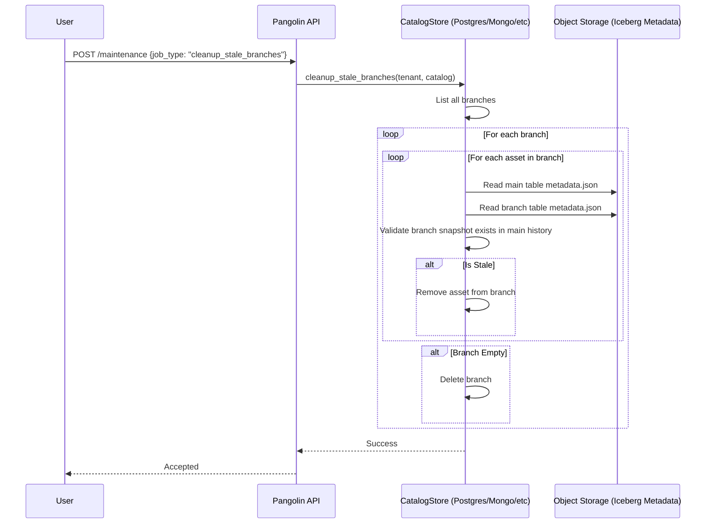

# Design Document: Snapshot-Based Branch Cleanup

## Problem Statement
When Iceberg snapshots are expired externally (e.g., via Spark, Flink, or direct filesystem operations), Pangolin's internal branch metadata may still point to these non-existent snapshots. This leads to broken branches and inconsistent catalog states.

## Proposed Solution
Implement a maintenance routine within the Pangolin API that validates branch snapshots against the underlying Iceberg metadata and removes "stale" references or branches.

## Architecture & Data Flow

## Detailed Implementation Steps

### 1. Model Updates (`pangolin_core`)
- No immediate model changes required as `Branch` already tracks its `assets`.

### 2. Trait Extension (`pangolin_store`)
- Add `async fn cleanup_stale_branches(...)` to `CatalogStore`.

### 3. Logic: Stale Asset Detection
An asset `A` in branch `B` (derived from table `T`) is stale if:
- The base snapshot ID referenced in `B@T` is no longer reachable from the current head of `T` in the `main` branch.
- Specifically, if `T@main` has expired snapshots such that the sequence number or snapshot ID in `B@T` is older than the oldest remaining snapshot in `main`.

### 4. Concurrency & Safety
- Use the existing CAS (Compare-And-Swap) mechanism in `update_metadata_location` if updating assets.
- For branch deletion, ensure no active sessions are locking the branch (though Pangolin's current branching is primarily metadata-based).

## Performance Considerations
- **Metadata Caching**: For tables with many branches, reading `metadata.json` repeatedly from S3 can be slow. Implementation should cache the `main` metadata for the duration of the job.
- **Batching**: Process cleanup in batches to avoid long-running database transactions.
